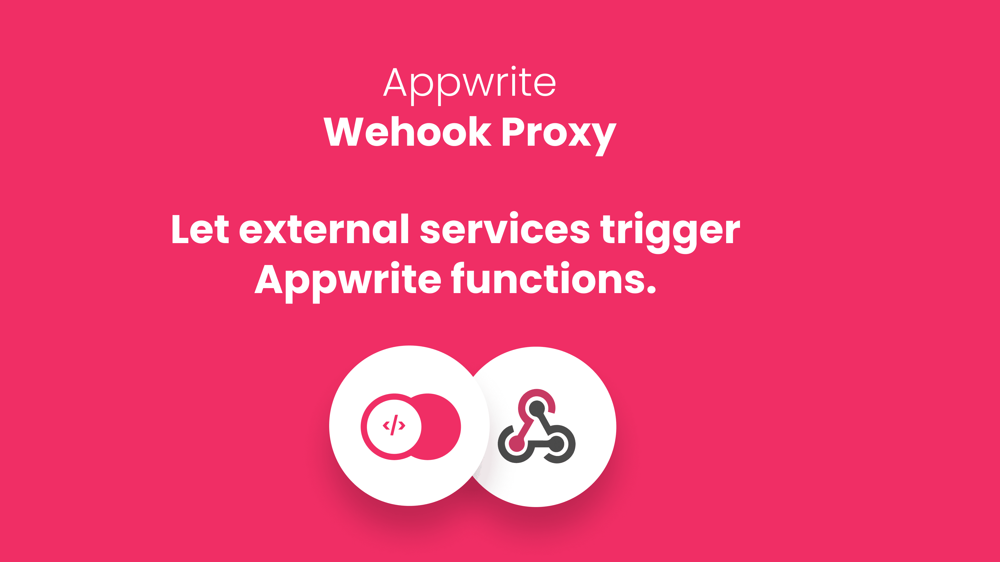

# Appwrite Webhook Proxy

A simple HTTP server behaving as proxy between webhooks and Appwrite Functions, allowing for instance Stripe payments integration into Appwrite.

**🚨 This is unofficial 3rd party exception for self-hosted Appwrite server 🚨**

_Maintained by core team member, tho 😛_

## Usage

0. Make sure to have Appwrite function that can print `APPWRITE_FUNCTION_DATA` for you, so you can see it working. You can use `appwrite-function.tar.gz` from this repo as example function. Make sure to use `NodeJS` runtime, and set command to `node index.js`.

1. Add webhook proxy container to Appwrite's docker stack. Locate `docker-compose.yml` file inside your `appwrite` folder, and add following section:

```yml
TODO: add (webhook-proxy)
```

2. Add webhook proxy configuration into Appwrite's stack. Locate hidden `.env` file inside your `appwrite` folder, and add following variables:

```
WEBHOOK_PROXY_APPWRITE_ENDPOINT=http://localhost/v1
WEBHOOK_PROXY_APPWRITE_PROJECT_ID=stripeTest
WEBHOOK_PROXY_APPWRITE_API_KEY=cb61e6bc3...abafcbb02
WEBHOOK_PROXY_APPWRITE_FUNCTION_ID=onStripeWebhook
```

> Make sure to replace values with your credentials and information

3. Restart Appwrite stack using `docker-compose up -d`

That's it! You can now visit `http://localhost/v1/webhook-proxy` (replace localhost with domain of Appwrite instance), and it will execute your function. You can see headers, endpoint, body, and pretty much all request information in the execution log, if you used our function tag from step 0.

## Contribution

Setup:

```bash
docker run --rm --interactive --tty \
  --volume $PWD:/app \
  composer update --ignore-platform-reqs --optimize-autoloader --no-plugins --no-scripts --prefer-dist
```

Run local version:

```bash
docker-compose up --build --force-recreate
```

> Use command above to also restart script after doing any changes.

## Release version

1. `docker login`
2. `docker build -t meldiron/appwrite-webhook-proxy:v0.0.1 .`
3. `docker push meldiron/appwrite-webhook-proxy:v0.0.1`

> Make sure to change version number with releasing new version
